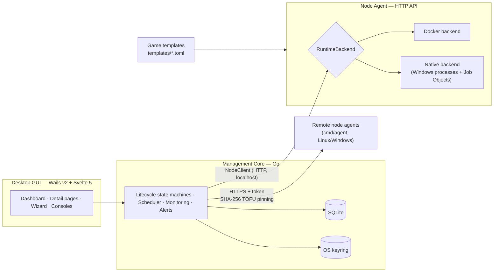
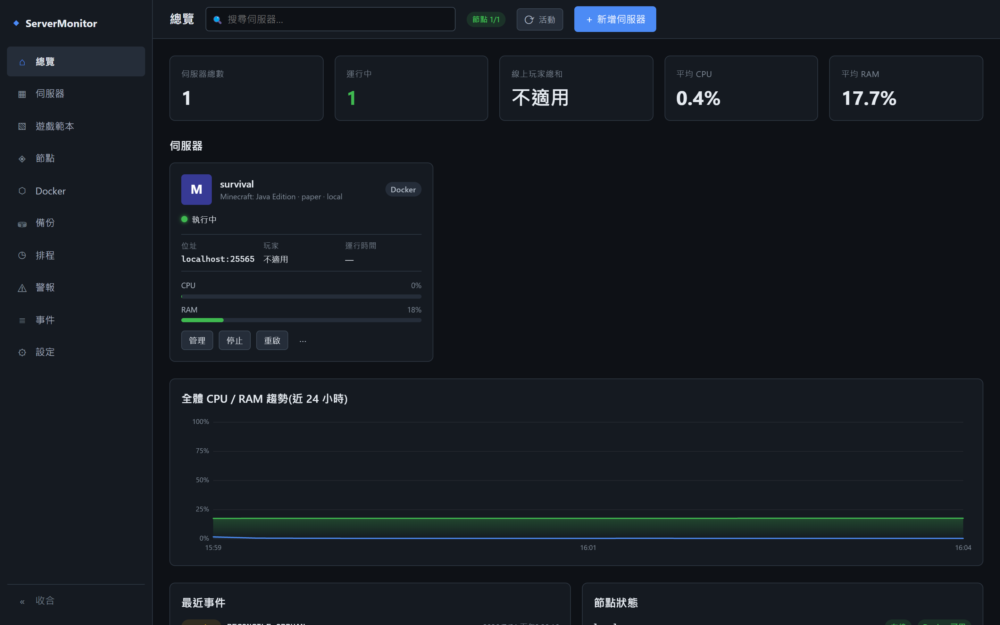
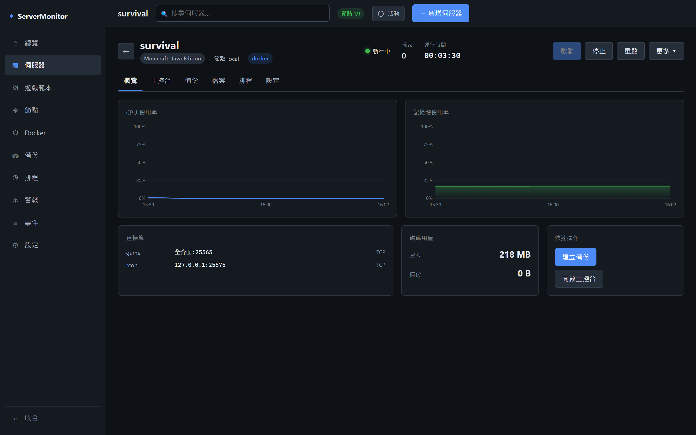
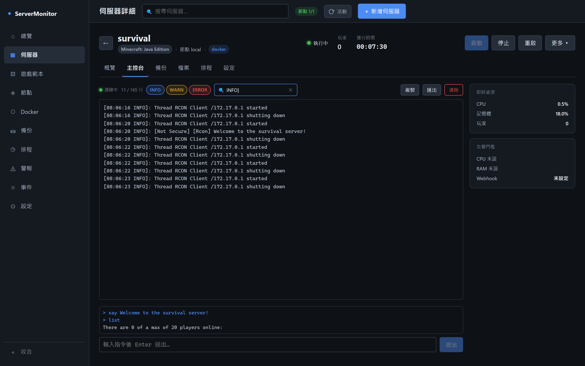

# ServerMonitor

> An extensible desktop manager for game dedicated servers — template-driven, dual runtime (Docker / native Windows processes), multi-node capable. Adding a new game means adding one TOML file, not touching the core.

**English** | [繁體中文](README.zh-TW.md)

[](https://github.com/q86865511/ServerMonitor/actions/workflows/ci.yml)


## Overview

ServerMonitor is a Windows desktop tool for running and monitoring game dedicated servers (Minecraft, Palworld, and other Steam dedicated servers). It covers the full operational loop — create, start, monitor, command, back up, auto-restart, alert — behind a single GUI, and is built around two core ideas:

- **Games are data, not code.** Every game is described by a declarative TOML template (ports, parameters, secrets, command protocols, health probes, lifecycle hooks, mod support). Supporting a new game that reuses an existing adapter means writing one template file.
- **Where and how servers run is pluggable.** Servers run in Docker containers or as native Windows processes behind the same `RuntimeBackend` interface, on the local machine or on remote nodes over TLS — the GUI and every feature above the backend behave identically.

## Key Technical Highlights

- **Template-driven extensibility** — a versioned TOML schema declares variants/loaders, port claims with conflict keys, typed parameters, secrets, RCON/REST command protocols as a tagged union, health probes, lifecycle hooks, and modpack policy. Built-in templates are embedded into the executable (`go:embed`); user templates load from the data directory at startup, with validation and rejection events — a template dropped in after launch takes effect on the next restart, not live.
- **Dual runtime backends behind one interface** — Docker containers, or native Windows child processes with everything auto-provisioned (Adoptium JRE, four Minecraft loader lines plus NeoForge modpack support, SteamCMD) and resource caps enforced via Windows Job Objects. Chosen per instance; backups are format-identical and convertible between the two backends.
- **Multi-node by construction** — the core talks to node agents over HTTP even on localhost. Remote Linux nodes run a single static agent binary with auto-generated persistent token + self-signed TLS, pinned in the GUI by SHA-256 fingerprint (TOFU); a swapped certificate is refused outright.
- **Path confinement as a hard rule** — every host path derived from an instance UUID, backup id, or user-supplied relative path passes a three-layer guard (clean → within-root check via `filepath.Rel` → per-segment `Lstat` refusing symlinks/junctions), closing traversal and link-following attacks including Windows junctions.
- **Crash recovery state machine** — protocol-aware readiness probes (RCON/REST, not just TCP), restart with retry caps, OOM-specific alerts distinguished from generic crashes, and orphan adoption: closing the tool never kills servers, and a restarted agent re-adopts still-running processes.
- **Secrets stay out of the core's files** — RCON passwords, node tokens, webhook URLs, and API keys live in the OS keyring (Windows Credential Manager), never in the SQLite database or config files; plaintext keys pasted into config are migrated into the keyring on next start and scrubbed from the file. On a node, the secrets a server actually needs to run reach it as an `instance.json` spec snapshot written `0600` inside the instance data root, excluded from the file manager and from backups.
- **Consistent backups** — quiesce/announce hooks, offline tar snapshots with checksums, scheduled or manual, restorable across Docker ↔ native.

## Architecture

Four layers, with strict interfaces between them:



Optional capabilities (backup deletion, image/container management, disk usage, file management) are expressed as cross-cutting interfaces implemented per backend — the core `RuntimeBackend` interface never grows for them.

## Screenshots

| Dashboard | Server detail |
|---|---|
|  |  |

Live log console with level filters, search, and an interactive RCON command line:



## Quick Start (users)

1. Install via the NSIS installer `servermonitor-amd64-installer.exe`, or run the portable `build\bin\servermonitor.exe`. **Windows defaults to the native backend (no Docker required)**; to use the Docker backend, start Docker Desktop first.
2. "Create server" → pick Minecraft → pick a variant → accept the EULA → set the RCON password → (optionally) choose the runtime backend → Create. First creation downloads the JRE + server files (native) or pulls the image (Docker) — allow a few minutes.
3. Start the server from its card → open the console to watch logs and run `list` → explore backups, schedules, and alerts in the settings tab.
4. Connect your game to `localhost:25565`. App data lives in `%LOCALAPPDATA%\ServerMonitor\`. Closing the window minimizes to the system tray; **closing the tool does not stop your servers** (containers keep running; native processes are re-adopted on next start).

## Build from Source

Requires Go 1.26+, Node 20.19+ or 22.12+ (per Vite's `engines.node`), and Wails CLI v2.13 (`go install github.com/wailsapp/wails/v2/cmd/wails@v2.13.0`).

```bash
cd frontend && npm ci && npm run build && cd ..   # build the embedded frontend bundle first
go build ./...        # compile all packages
wails dev             # development mode (GUI)
wails build           # produce the Windows executable
wails build -nsis     # additionally produce the NSIS installer
go build ./cmd/agent  # headless node agent for remote nodes
```

`main.go` embeds `frontend/dist` via `//go:embed`; a fresh clone ships only a `.gitkeep` placeholder there, so `go build ./...` compiles but serves no UI until the frontend bundle is built. `wails dev` / `wails build` run the frontend build themselves.

## Testing

| Command | Scope |
|---|---|
| `go test ./...` | Unit/integration tests (no Docker needed) |
| `go test -tags docker ./...` | Real-Docker integration + E2E + perf benchmarks |
| `go test -tags docker -run TestE2E ./internal/app/` | Full lifecycle E2E (pulls images, auto-cleans) |
| `go test -tags native ./...` | Native backend tests (Windows; auto-skip elsewhere) |
| `go test -tags "docker native" -run TestBackupInterop_DockerNative ./internal/agent/` | Docker ↔ native backup interconversion |

The E2E suites exercise the real thing: create → start → probe readiness → run commands → back up → restore → stop → remove, against actual Minecraft and Palworld servers.

> `go test -tags docker ./...` runs packages in parallel by default; several E2E tests contending for the same Docker daemon at once can produce spurious timeouts (`TestE2E_MinecraftFullLifecycle` has been observed to fail this way while passing standalone in under two minutes). Add `-p 1` to serialize package execution, or run the E2E tests one at a time as shown above.

## Signature Systems

### Lifecycle & Provisioning
Serialized, idempotent operations with atomic creation and port reservation. Long operations (create/start/stop/restart/backup) stream stage-level progress (pulling image / installing / waiting for readiness) into the console and a global operations panel.

### Monitoring & Consoles
CPU/RAM/disk and player-count polling with 15-second aggregated time series persisted for 36 hours (charts draw gaps for missing data instead of faking zeros); a live log console with backpressure-safe fanout; an interactive command console speaking RCON (Minecraft) or named REST actions with Basic Auth (Palworld).

### Backups & Restore
Scheduled or manual, announced via in-game hooks, taken as stop-consistent tar snapshots with checksums. Backups restore in place, and convert a running instance between Docker and native backends.

### Auto-restart & Alerts
A supervisor state machine with health probes and bounded retries restarts crashed servers; Discord webhooks deliver alerts with time-window suppression, hysteresis, and dedup — OOM kills are reported distinctly from generic crashes.

### Mods & Modpacks
Paper/Forge/Fabric/Vanilla loader lines, plus NeoForge support at the modpack-compatibility layer (not yet a standalone creatable variant); Modrinth modpacks on both backends; CurseForge via itzg's `AUTO_CURSEFORGE` (Docker) or a built-in Prism-style installer (native) that honors author opt-outs with an honest manual-download fallback. See [docs/native-mode.md](docs/native-mode.md).

### Multi-node
Manage servers on remote hosts from the same GUI: a single-binary agent, HTTPS with fingerprint-pinned self-signed certs (or bring your own), per-node tokens in the keyring. See [docs/multi-node.md](docs/multi-node.md).

## Supported Games

| Game | Variants / loaders | Backends | Commands | Mods |
|---|---|---|---|---|
| Minecraft (Java) | Vanilla · Paper · Fabric · Forge (NeoForge: modpacks only, no standalone variant) | Docker + Native | RCON | Modrinth · CurseForge |
| Palworld | Steam dedicated server | Docker + Native (SteamCMD) | REST named actions | — |
| *Your game* | declared in one `templates/<id>.toml` | per template | RCON / REST | per template |

## Project Structure

```text
cmd/agent          # headless node agent (single binary for remote nodes)
internal/core      # management core: state machines, scheduler, monitoring, alerts
internal/agent     # node agent: HTTP API, Docker/native backends, provisioning, backups
internal/app       # Wails bindings and E2E tests
internal/protocol  # shared types and the template schema
templates/         # built-in game templates (embedded into the executable)
frontend/          # Svelte 5 + TypeScript GUI
docs/              # user & developer guides
specs/             # spec-driven development: requirements/design/tasks × 3 features
```

## ⚠️ Known Limitations

- Windows 11 is the supported desktop platform; Linux machines participate as remote Docker nodes.
- Remote nodes: background monitoring/reconciliation is not yet enabled (operations and logs work); backups stay on their owning node.
- The native backend has no container-level isolation (filesystem/network); port conflicts surface as OS bind errors.
- CurseForge on the native backend requires an API key (embedded at build time or supplied by the user); forks must obtain their own key per CurseForge's third-party API terms.

## Document Index

| Document | Content |
|---|---|
| [docs/template-guide.md](docs/template-guide.md) | Template schema reference — how to add a game |
| [docs/native-mode.md](docs/native-mode.md) | Native (no-Docker) backend & CurseForge modpacks |
| [docs/multi-node.md](docs/multi-node.md) | Remote/cloud node deployment & security |
| [docs/development.md](docs/development.md) | Build, test matrix, pinned dependency versions |
| [specs/README.md](specs/README.md) | Spec-driven development index (3 feature suites, all shipped) |
| [CLAUDE.md](CLAUDE.md) | Project conventions for AI-assisted development |

## License

This project is licensed under the [MIT License](LICENSE).
