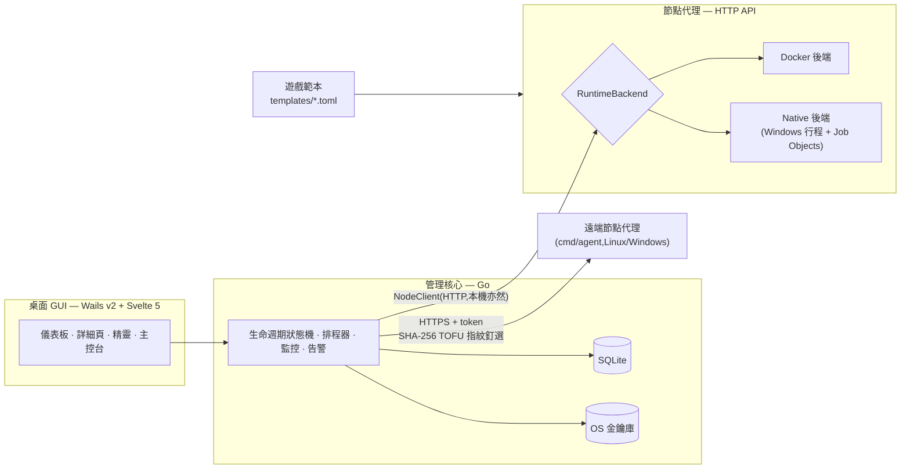

# ServerMonitor

> 可擴充的遊戲專用伺服器管理桌面工具——範本驅動、雙執行後端(Docker/原生 Windows 行程)、支援多節點。新增一個遊戲=加一份 TOML 檔,不動核心程式。

[English](README.md) | **繁體中文**


## 總覽

ServerMonitor 是 Windows 桌面工具,用來執行與監控遊戲專用伺服器(Minecraft、Palworld 及其他 Steam dedicated server)。它在單一 GUI 內涵蓋完整營運循環——建立、啟動、監控、下指令、備份、自動重啟、告警——並圍繞兩個核心設計:

- **遊戲是資料,不是程式碼。** 每個遊戲由一份宣告式 TOML 範本描述(埠、參數、機密、指令協定、健康探針、生命週期 hook、模組政策)。支援一個沿用既有 adapter 的新遊戲,只需寫一份範本檔。
- **伺服器「在哪跑、怎麼跑」是可抽換的。** 伺服器可以跑在 Docker 容器或原生 Windows 行程,兩者藏在同一個 `RuntimeBackend` 介面之後;可以在本機,也可以在經 TLS 管理的遠端節點——GUI 與後端之上的所有功能行為完全一致。

## 技術亮點

- **範本驅動的擴充性** — 帶版本的 TOML schema 宣告變體/loader、含衝突鍵的埠宣告、型別化參數、機密、RCON/REST 指令協定(tagged union)、健康探針、生命週期 hook 與模組包政策。內建範本以 `go:embed` 打進執行檔;自訂範本從資料目錄載入,驗證失敗會拒載並記事件。
- **同一介面下的雙執行後端** — Docker 容器,或全自動供應的原生 Windows 子行程(Adoptium JRE、五種 Minecraft loader、SteamCMD),資源上限以 Windows Job Objects 強制。逐實例選擇;備份格式相同,可在兩後端間互轉。
- **天生多節點** — 核心即使對本機也走 HTTP 與節點代理溝通。遠端 Linux 節點跑單一靜態 agent 執行檔,自動產生持久 token 與自簽 TLS 憑證,GUI 以 SHA-256 指紋釘選(TOFU);憑證被換直接拒連。
- **路徑拘束是硬規則** — 任何由實例 UUID、備份 id 或使用者相對路徑拼出的宿主路徑,都要過三層防禦(clean → `filepath.Rel` within-root 檢查 → 逐段 `Lstat` 拒絕 symlink/junction),封死路徑遍歷與連結穿越攻擊(含 Windows junction)。
- **崩潰復原狀態機** — 協定感知的就緒探針(RCON/REST,不只 TCP)、有重試上限的自動重啟、與一般 crash 區分的 OOM 告警、孤兒收養:關掉工具不會殺伺服器,agent 重啟後自動接管仍在跑的行程。
- **機密不以明文落地** — RCON 密碼、節點 token、webhook URL、API 金鑰全存 OS 金鑰庫(Windows 認證管理員);貼進設定檔的明文金鑰下次啟動自動遷入金鑰庫並從檔案抹除。
- **一致性備份** — quiesce/announce hook、停機一致 tar 快照 + checksum,支援排程與手動,可跨 Docker ↔ native 還原。

## 架構

四層,層間以嚴格介面隔離:



可選能力(備份刪除、映像/容器管理、磁碟用量、檔案管理)一律以橫切介面表達、各後端自行實作——核心 `RuntimeBackend` 介面不為它們擴張。

## 畫面截圖

| 總覽儀表板 | 伺服器詳細頁 |
|---|---|
|  |  |

即時 log 主控台(等級過濾、搜尋、互動 RCON 指令列):


## 快速開始(使用者)

1. 執行 NSIS 安裝包 `servermonitor-amd64-installer.exe`,或直接跑可攜版 `build\bin\servermonitor.exe`。**Windows 預設 native 執行後端(免 Docker)**;要用 Docker 後端請先開啟 Docker Desktop。
2. 「建立伺服器」→ 選 Minecraft → 選變體 → 勾 EULA → 設 RCON 密碼 →(可選)選執行後端 → 建立。首次建立會下載 JRE + 伺服器檔案(native)或拉映像(Docker),需數分鐘。
3. 卡片「啟動」→ 開主控台看 log、輸入 `list` 測指令 → 到設定分頁玩備份/排程/告警。
4. 遊戲連線 `localhost:25565`。應用資料在 `%LOCALAPPDATA%\ServerMonitor\`。關閉視窗會縮到系統匣;**關閉本工具不會停伺服器**(容器繼續跑;native 行程下次啟動自動收養)。

## 從原始碼建置

需 Go 1.26+、Node 18+、Wails CLI v2.13(`go install github.com/wailsapp/wails/v2/cmd/wails@v2.13.0`)。

```bash
go build ./...        # 編譯全部套件
wails dev             # 開發模式(GUI)
wails build           # 產出 Windows 可執行檔
wails build -nsis     # 另產出 NSIS 安裝包
go build ./cmd/agent  # 遠端節點用的無 GUI 節點代理
```

## 測試

| 指令 | 範圍 |
|---|---|
| `go test ./...` | 單元/整合測試(免 Docker) |
| `go test -tags docker ./...` | 真 Docker 整合 + 端到端 + 效能基準 |
| `go test -tags docker -run TestE2E ./internal/app/` | 全生命週期 E2E(拉映像,測後自動清理) |
| `go test -tags native ./...` | native 後端測試(Windows;其他平台自動 skip) |
| `go test -tags "docker native" -run TestBackupInterop_DockerNative ./internal/agent/` | docker ↔ native 備份互轉 |

E2E 測的是真實流程:建立 → 啟動 → 就緒探測 → 下指令 → 備份 → 還原 → 停止 → 移除,對象是真正的 Minecraft 與 Palworld 伺服器。

## 招牌系統

### 生命週期與供應
序列化、冪等的操作,原子建立 + 埠預留。長操作(建立/啟動/停止/重啟/備份)以階段級進度(拉映像/安裝中/等待就緒)串流到主控台與全域操作面板。

### 監控與主控台
CPU/RAM/磁碟與線上人數輪詢,15 秒聚合時序持久化 36 小時(缺值畫缺口、不補 0);背壓安全 fanout 的即時 log 主控台;互動指令主控台支援 RCON(Minecraft)與帶 Basic Auth 的 REST 具名動作(Palworld)。

### 備份與還原
排程或手動,經遊戲內 hook 預告,做停機一致 tar 快照 + checksum。可原地還原,也可讓同一實例在 Docker 與 native 後端之間轉換。

### 自動重啟與告警
帶健康探針與重試上限的監督狀態機自動重啟崩潰的伺服器;Discord webhook 告警支援時間窗抑制、遲滯與去重——OOM 與一般 crash 分開回報。

### 模組與模組包
Paper/Forge/Fabric/NeoForge/Vanilla 五線 loader;Modrinth 模組包兩後端皆支援;CurseForge 走 itzg 的 `AUTO_CURSEFORGE`(Docker)或內建 Prism 式安裝器(native),尊重作者停用第三方散布並提供誠實的手動下載降級流程。見 [docs/native-mode.md](docs/native-mode.md)。

### 多節點
同一個 GUI 管理遠端主機上的伺服器:單一執行檔 agent、指紋釘選的自簽 HTTPS(或自備憑證)、逐節點 token 入金鑰庫。見 [docs/multi-node.md](docs/multi-node.md)。

## 支援的遊戲

| 遊戲 | 變體 / loader | 後端 | 指令 | 模組 |
|---|---|---|---|---|
| Minecraft(Java) | Vanilla · Paper · Fabric · Forge · NeoForge | Docker + Native | RCON | Modrinth · CurseForge |
| Palworld | Steam dedicated server | Docker + Native(SteamCMD) | REST 具名動作 | — |
| *你的遊戲* | 一份 `templates/<id>.toml` 宣告 | 依範本 | RCON / REST | 依範本 |

## 專案結構

```text
cmd/agent          # 無 GUI 節點代理(遠端節點用單一執行檔)
internal/core      # 管理核心:狀態機、排程器、監控、告警
internal/agent     # 節點代理:HTTP API、Docker/native 後端、供應、備份
internal/app       # Wails 綁定與 E2E 測試
internal/protocol  # 共用型別與範本 schema
templates/         # 內建遊戲範本(嵌入執行檔)
frontend/          # Svelte 5 + TypeScript GUI
docs/              # 使用者與開發者指南
specs/             # 規格驅動開發:三組 requirements/design/tasks
```

## ⚠️ 已知限制

- 桌面支援平台為 Windows 11;Linux 機器以遠端 Docker 節點身分參與。
- 遠端節點:背景監控/對帳尚未啟用(操作與日誌可用);備份檔留在其所屬節點。
- native 後端無容器級隔離(檔案系統/網路);埠衝突以 OS bind 失敗直接回報。
- native 後端的 CurseForge 需 API 金鑰(建置期內嵌或使用者自填);依 CurseForge 第三方 API 條款,fork 須自行申請金鑰。

## 文件索引

| 文件 | 內容 |
|---|---|
| [docs/template-guide.md](docs/template-guide.md) | 範本 schema 參考——如何新增一個遊戲 |
| [docs/native-mode.md](docs/native-mode.md) | Native(免 Docker)後端與 CurseForge 模組包 |
| [docs/multi-node.md](docs/multi-node.md) | 遠端/雲端節點部署與安全 |
| [docs/development.md](docs/development.md) | 建置、測試矩陣、依賴版本鎖定 |
| [specs/README.md](specs/README.md) | 規格驅動開發索引(三組功能規格,均已收官) |
| [CLAUDE.md](CLAUDE.md) | AI 輔助開發的專案約定 |
